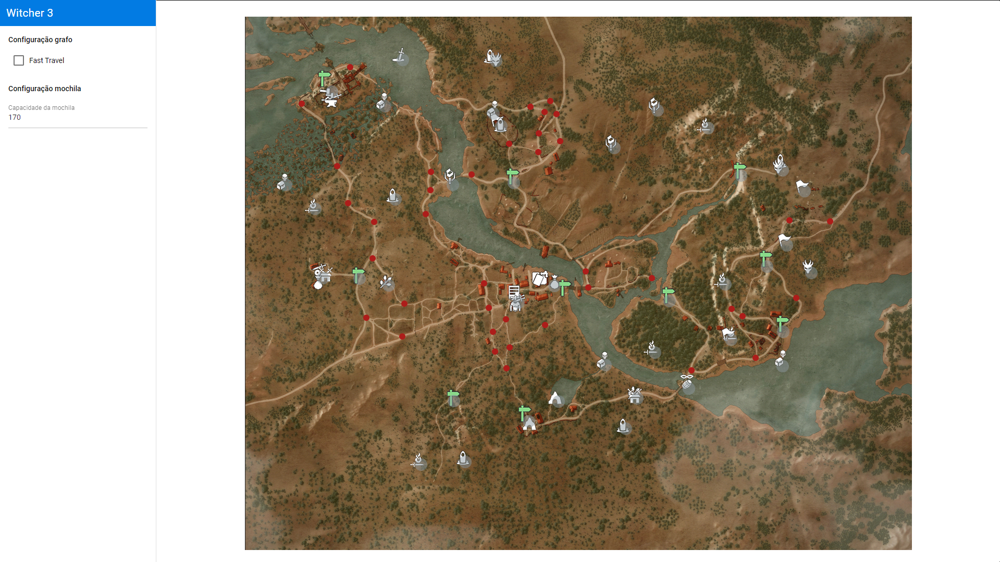
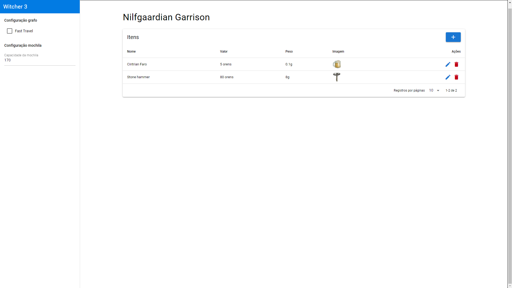
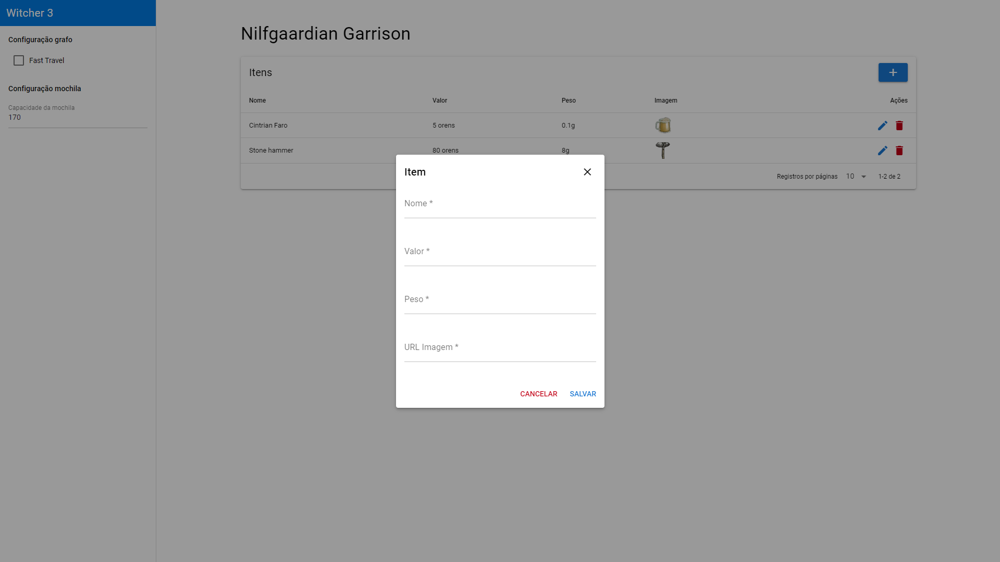
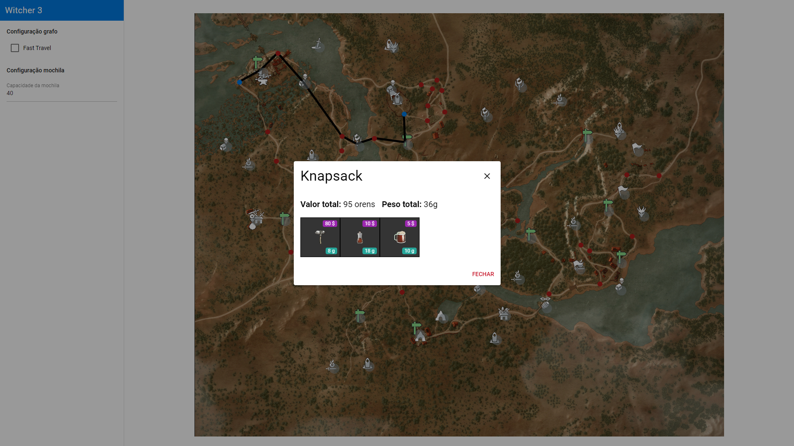

# NomedoProjeto

**Conteúdo da Disciplina**: Final<br>

## Alunos
| Matrícula | Aluno |
| -- | -- |
| 18/0018728  |  Igor Batista Paiva |
| 18/0028260  |  Thiago Aparecido Lopes Santos |

## Sobre
O projeto consiste em um mapa da região de *White Orchard*, do jogo *The Witcher 3*, onde o usuário poderá escolher dois pontos no mapa, e o algoritmo calculará qual é o melhor caminho entre eles. Além disso, o usuário poderá cadastrar itens a serem pegos durante o percurso, e o peso máximo que o seu inventário suporta. Ao passar por um determinado local, os items cadastrados serão adicionados ao inventário do usuário, e caso não haja espaço para todos os itens na mochila, a melhor disposição dos mesmos (baseado no peso e no valor de cada item) será mantida, e os itens que não couberem serão descartados.

### Algoritmos utilizados

- Grafos (Busca)
  - Dijkstra
- Programação Dinâmica
  - Knapsack Problem

Acesse o vídeo [aqui](https://github.com/projeto-de-algoritmos/Final_IgorPaivaThiagoLopes/blob/8a305f1a15b34e2d1cb05fc00fbb9dd822715aa4/apresentacao.mp4).

## Screenshots
### Página Inicial (Mapa)


### Tela de gerência dos itens de um ponto de interesse


### Modal de cadastro de itens


### Execução dos algoritmos após a escolha de dois pontos no mapa


## Instalação
**Linguagem**: JavaScript<br>
**Framework**: Vue.JS<br>
Para executar, primeiramente é necessário ter o [yarn](https://classic.yarnpkg.com/lang/en/docs/install) instalado.

Posteriormente, execute:

```
yarn
```

para a instalação das dependências e:

```
yarn quasar dev
```

para iniciar o projeto.

## Uso
Após iniciar o projeto, acesse seu [localhost](http://localhost:8080/), e na página inicial você terá acesso a uma representação do mapa do jogo.
Note que o mapa possui pontos vermelhos e azuis que simbolizam os nós do grafo.

Para que seja exibido o menor caminho entre 2 pontos no mapa, basta selecionar dois nós dispostos no mesmo, sendo que o primeiro nó representará o ponto de partida, e o segundo representará o ponto de chegada. Após a seleção de ambos, um dos menores caminhos possíveis entre os dois nós será desenhado no mapa por meio de retas. Para desfazer a seleção, basta clicar em qualquer lugar do mapa.

Para cadastrar itens nos pontos de interesse desejados, basta clicar com o botão direito no nó correspondente, e então haverá um redirecionamento para a página de gerência dos itens. Nessa página, basta clicar no ícone "+" e preencher as informações necessárias. Ao final da execução do algoritmo, uma modal com as informações do inventário para essa jornada será apresentada, mostrando quais foram os itens escolhidos a partir do peso máximo suportado e o valor de cada item.

Para inserir o peso máximo do inventário, basta preencher o campo "Capacidade da mochila" no canto esquerdo da página.

Obs.: O peso é dado em gramas.

Fast Travel:

As placas verdes dispostas no mapa representam pontos de viagem rápida (Fast Travel). Isso significa que o jogador pode ir de um ponto de viagem rápida a outro sem passar pela estrada, fazendo com que seja possível que o caminho entre dois determinados pontos seja mais rápido.
